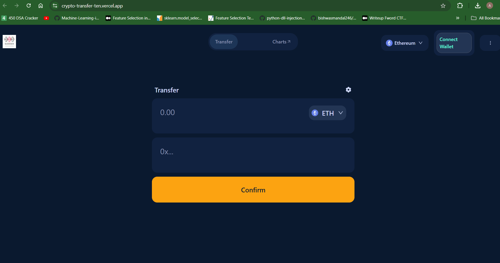

# Crypto Transfer

This project is a simple decentralized application (DApp) built for transferring ETH between accounts. It leverages **Next.js** for the frontend, **Sanity.io** for the backend and store transaction details, and **Solidity** for the smart contract logic. The smart contract is deployed on the **Sepolia test network**, and the frontend is hosted on **Vercel**.

## Live Demo

You can view the live version of the DApp here: [Live Demo](https://crypto-transfer-ten.vercel.app/)

## Screenshots




## Features

- Send ETH between two accounts.
- Stores transaction history in **Sanity.io** for easy retrieval.
- Secure and decentralized using Ethereum's blockchain technology.
- Deployed on the **Sepolia** test network for development and testing purposes.

## Technology Stack

- **Frontend**: [Next.js](https://nextjs.org/) (React-based framework)
- **Backend**: [Sanity.io](https://www.sanity.io/) (for storing transaction data)
- **Smart Contract**: [Solidity](https://soliditylang.org/) (for Ethereum-based smart contracts)
- **Network**: Sepolia test network (for contract deployment and testing)
- **Deployment**: [Vercel](https://vercel.com/) (for hosting the frontend)


To run this project on your local machine, follow these steps:

### Prerequisites

- [Node.js](https://nodejs.org/en/) (v14+)
- [Next.js](https://nextjs.org/docs/getting-started) installed
- [Metamask](https://metamask.io/) wallet extension
- Access to the Sepolia test network (obtain test ETH via a [faucet](https://faucet.sepolia.dev/))

### 1. Clone the repository

```bash
git clone https://github.com/ArijitGuha0179/Crypto_Transfer.git
cd Crypto_Transfer
```

### 2. Install dependencies

```bash
npm install
```

### 3. Set up environment variables

Create a `.env` file in the root directory and add the following environment variables:

```bash
SANITY_TOKEN=
SANITY_APP_ID=
```

### 4. Run the development server

```bash
npm run dev
```

Navigate to [http://localhost:3000](http://localhost:3000) in your browser.

### Sanity Setup

1. Set up a [Sanity.io](https://www.sanity.io/) project.
2. Create a schema for storing transaction details (e.g., sender, receiver, amount, timestamp).
3. Connect the project to your DApp using the `sanity-cli` package.
